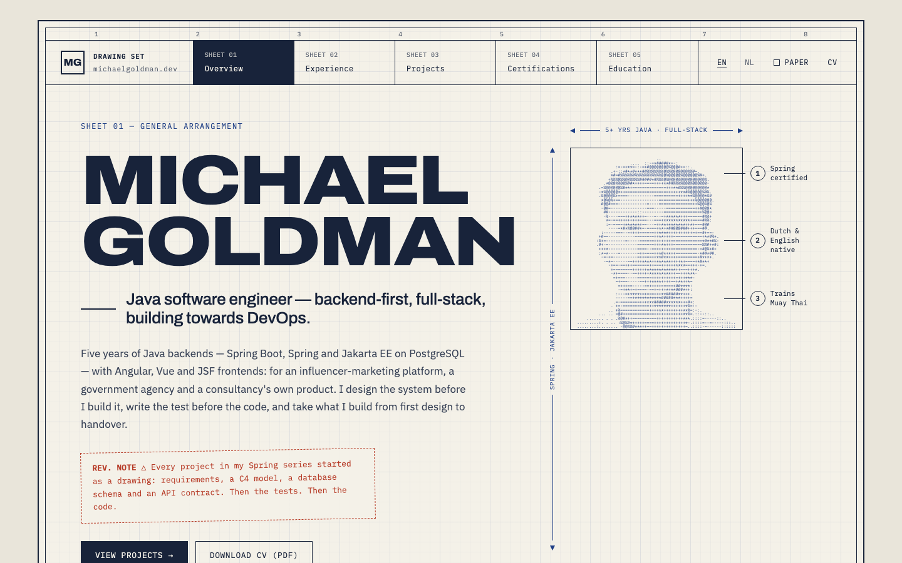

# michaelgoldman.dev

[](https://github.com/mikebg95/portfolio/actions/workflows/ci.yml)

Portfolio site of Michael Goldman, Java software engineer in Amsterdam —
[michaelgoldman.dev](https://michaelgoldman.dev).



## The concept: a drawing set

The site is laid out as a set of engineering drawings. Every page is a sheet on gridded paper with a
frame, a sheet index for navigation, dimension lines, numbered callout balloons, red revision notes,
spec tables, parts lists and a title block:

| Sheet | Page           | Drawn as                                                     |
| ----- | -------------- | ------------------------------------------------------------ |
| 01    | Overview       | general arrangement — name, role, portrait with balloons     |
| 02    | Experience     | a timeline drawn to scale                                    |
| 03    | Projects       | a drawing register, with a detail sheet per project          |
| 04    | Certifications | an inspection record — stamped certificates                  |
| 05    | Education      | an exploded assembly view with its parts list                |

English lives at `/`, Dutch at `/nl/` — the same sheets with the same structure. Two themes: paper
(light) and blueprint (dark).

## Stack

- [Astro](https://astro.build) 7, fully static output, TypeScript in strict mode
- Plain CSS with custom properties generated from `design/tokens.json` — no CSS framework
- GSAP + ScrollTrigger, loaded only on the two scroll-scrubbed sheets
- Content collections (EN + NL YAML) for every piece of text
- Vitest (unit), Playwright (end-to-end, desktop Chrome, Android Chrome, iPhone Safari), axe-core
  (WCAG 2.2 AA), Lighthouse CI (budgets for performance, accessibility, best practices
  and SEO)
- ESLint and Prettier
- Docker image: the static build served by unprivileged nginx with precompressed brotli and gzip

## Running it

Needs Node 22.12 or later (`.nvmrc`).

```sh
npm ci
npm run dev          # http://localhost:4321
npm run build        # static site into dist/
npm run preview      # serves dist/ on http://localhost:4321
```

Tests and checks:

```sh
npm run typecheck
npm run lint
npm run format:check
npm test             # unit tests
npm run test:e2e     # builds, serves and runs Playwright on three browser profiles
npm run lhci         # Lighthouse CI against a built dist/
npm run verify       # all of the above, in order
```

The container:

```sh
docker build -t michaelgoldman-dev . && docker run --rm -p 8080:8080 michaelgoldman-dev
scripts/docker-smoke.sh   # builds the image and checks status codes, headers and compression
```

The screenshot above is regenerated with `npm run build && npm run screenshot`.

## Motion

Motion follows the drawing metaphor: on the first visit each sheet plots itself — frame, grid, then
the text inked in — further content inks in as it scrolls into view, and the Experience timeline and
the Education exploded view are scrubbed by the scroll position. Every animation starts from a state
written only for visitors with JavaScript and no reduced-motion preference, so without either the
page is simply drawn in its final state.

## Pipeline

- **CI** (`.github/workflows/ci.yml`, every push and pull request): typecheck, lint, format and unit
  tests followed by a build; the Playwright suite with axe on every page; Lighthouse CI on the built
  site; and a Docker image build.
- **Deploy** (`.github/workflows/pages.yml`, every push to `main`): builds the site and publishes
  it to GitHub Pages under the custom domain.

## Where things are

- `src/` — pages, layouts, components, content collections and styles
- `tests/unit/`, `src/**/*.test.ts` — unit tests; `tests/e2e/` — Playwright specs
- `design/` — the drawings, tokens, components, motion and copy the site is built from
- `SPEC.md`, `NOTES.md` — the specification and its invariants
